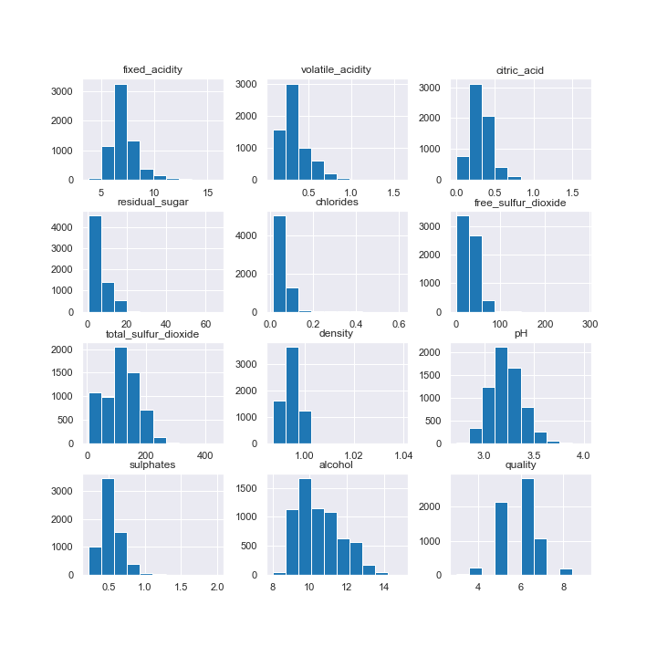
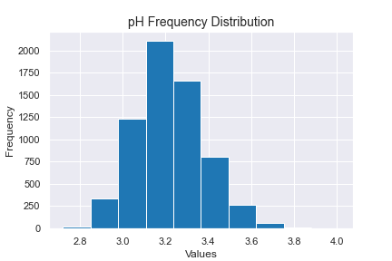
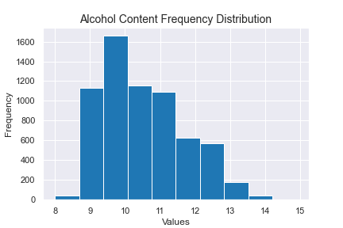
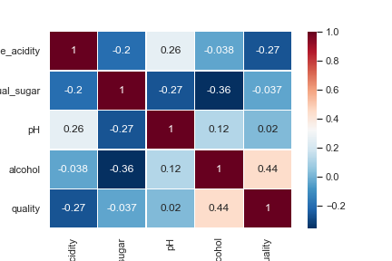
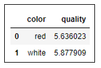
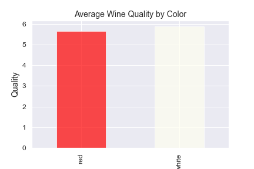
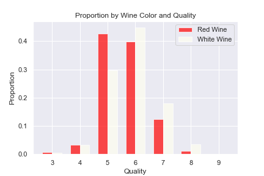
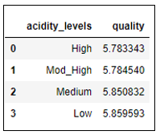
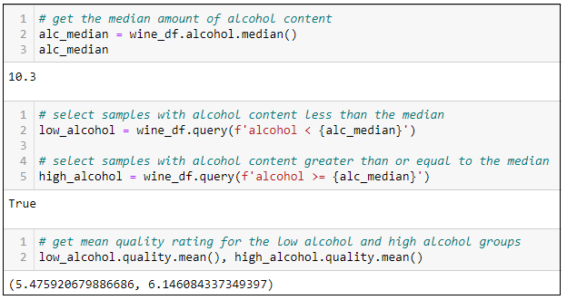
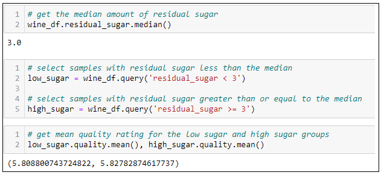

# Wine Quality Analysis
*Wine quality analysis with Python, Pandas, NumPy and Matplotlib*

## Project Overview 
For this project I am analyzing two datasets from [UCI - Machine Learning Repository](https://archive.ics.uci.edu/ml/datasets/wine+quality). One dataset on red wine samples and the other on white wine samples from the north of Portugal. Each wine sample comes with a quality rating from 1 to 10 and results form several physicochemical tests. I will be analysing wine properties such as alcohol content, acidity level and residual sugar and how these correlate to wine quality.

***Attribute Information:*** 
- [x] fixed acidity 
- [x] volatile acidity 
- [x] citric acid 
- [x] residual sugar 
- [x] chlorides 
- [x] free sulfur dioxide 
- [x] total sulfur dioxide 
- [x] density 
- [x] pH 
- [x] sulphates 
- [x] alcohol 
- [x] quality (score between 0 and 10) 

*Note: Due to privacy and logistic issues, only data on these physicochemical properties and quality ratings are available (e.g. there is no data about grape types, wine brand, wine selling price, etc.)*

## EDA (Data Investigation Data Cleaning & Feature Engineering)
EDA (Exploratory Data Analysis) as in “A first look at the data” is used to understand and summarize the content of the dataset, such as initial look at the columns, data types, data quality, data statistics and data relationships. Moreover, data often require a significant amount of work to make it suitable for analysis like cleaning, feature engineering and visualizing. Python packages such as Pandas, NumPy and Matplotlib help work faster and more efficiently when performing EDA.

## Data Processing
In order to perform sufficient data analysis data needs to be manipulated. In this analysis I used Pandas functions such as `groupby`, `query` and `binning` amongst others. Data processing and data manipulation is essential for any data analysis and with a thoughtful approach we can get useful insights about the given dataset and recommendations beyond this analysis. 

## Research Questions
As mentioned above EDA is an important step in data analytics. This critical step can save roughly 15–50% of time on a project because it provides a targeted plan for how to clean, sort, and create smaller datasets that are easier to work with. It is also extremely important to familiarize with the dataset, what various features mean and what values represent. Based on that we can conclude what questions can be answered from the data or do we need to collect more data in order to provide comprehensive analysis.

In this analysis I will be focusing on the following questions: 
- 🍷 What chemical characteristics are most important in predicting the quality of wine? 
- 🍷 Is a certain type of wine (red or white) associated with higher quality? 
- 🍷 Do wines with higher alcohol content receive better ratings? 
- 🍷 Do sweeter wines (more residual sugar) receive better ratings? 
- 🍷 What level of acidity is associated with the highest quality? 

## Answering Questions with Data and Drawing Conclusions

### What chemical characteristics are most important in predicting the quality of wine?

With Python and Matplotlib we can plot a histogram in one line of code, and observe the frequency of distribution for various features.  We can read frequency on y-axis and feature values on the x-axis. We can easily plot histograms for the entire dataset, for all features as well as individual features to get a more detailed look. From the histograms below we can see, for example that the most frequent pH value of wines is around a value of 3.2, and alcohol level around value of 10. The code for histograms and correlation can be found [here](Wine_Quality_EDA.ipynb).

 

<i>Figure 1: Frequency Distributions for Wine Characteristics for all Features.</i>

 

<i>Figure 2 & 3: pH Value Frequency Distribution & Alcohol Content Frequency Distribution.</i>

A great way to explore, to get familiar with the data, finding patterns and building intuitions is to calculate, visualize and uncover complex and unknown relationships between variables. With the `corr` function we can plot the entire dataset and explore correlations between variables. For example correlation between alcohol content and quality rating is 0.44. This indicates weak positive correlation, while residual sugar with the value of -0.037 indicates almost no correlation. 

 

<i>Figure 4: Correlation between Variables</i>

### Is a certain type of wine (red or white) associated with higher quality?

Using pandas `groupby` we can quickly group wine by type and calculate the mean of quality rating. Based on the calculations we can see that white wines have slightly higher quality ratings at 5.88 than red wines at 5.64.

 

<i>Figure 5: Wine Quality Rating.</i>

 

<i>Figure 6: Wine Quality Rating & Wine Quality Rating and Frequency.</i>

### The quality rating for red wine is slightly lower than for white wine

What level of acidity is associated with the highest quality?

In order to effectively answer this question I categorized pH values in the following categories: 
High acidity level: 2.72 - 3.11 
Moderate High acidity level: 3.12 - 3.21 
Medium acidity level: 3.22 - 3.21 
Low acidity level: 3.33 - 4.01 

### Low level of acidity receives the highest mean quality rating

 

<i>Figure 7: Wine Quality Rating and pH.</i>

### Do wines with higher alcohol content receive better ratings?

Another useful function in Python is `query`. With this function we can quickly filter data that we want to perform calculations on. We can find median value with `median` function and split data into two categories - wines with low alcohol content and wines with high alcohol content. We find the median value of alcohol lever at 10.3.Wines with higher alcohol content tend to have higher quality rating.

 

<i>Figure 8: Quality Rating and alcohol content/</i>

 
### Do sweeter wines (more residual sugar) receive better ratings?

To answer this question I used a similar approach than in the question above. After finding a median value for residual sugar I split data into two parts and calculated the quality rating mean on those two datasets. Based on our calculations  Sweeter wines generally receive slightly higher ratings at 5.83 than low sugar wines with quality rating at 5.81. 

 

<i>Figure 9: Quality Rating and Residual Sugar/</i>

## Conclusion 
Wine quality analysis  [add add add]

